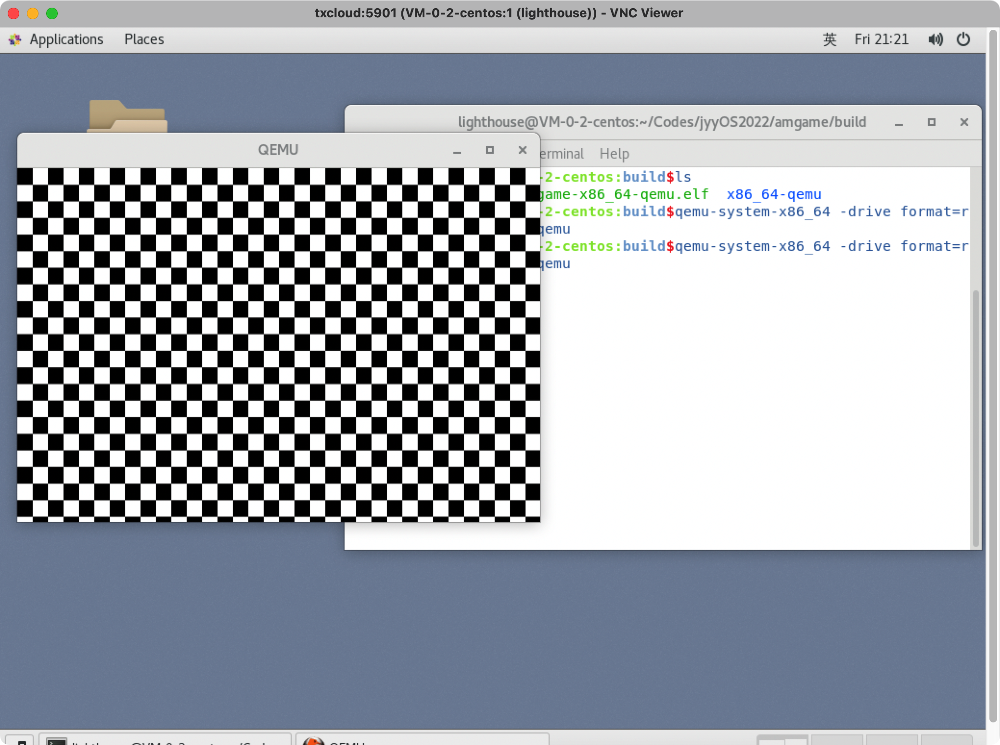

# jyyOS2022

2022南大jyy操作系统设计与实现课程相关代码

## amgame

[[L0]amgame实验要求](http://jyywiki.cn/OS/2022/labs/L0)

该试验需要借助桌面系统，因此推荐如下几种方式：

1. 安装linux-desktop虚拟机
2. [使用windows-wsl配合窗口工具](https://zhuanlan.zhihu.com/p/499141891)
3. 使用linux服务器+[远程桌面](https://www.jb51.net/article/172131.htm)

这里使用方式三。

### 实验环境搭建

1. 拉取远程框架

```bash
git clone https://github.com/NJU-ProjectN/os-workbench-2022  # 有就别拉了
cd os-workbench-2022
# git pull origin L0
git checkout L0
```

2. 先跑起来再说，进入目录，编译

```bash
cd amgame
make
# 成功之后获得build文件夹
# cd build
```

3. 从桌面环境（请各显神通）的terminal进入build目录

```bash
user@hostname:build$ qemu-system-x86_64 -drive format=raw,file=amgame-x86_64-qemu
```

获得如下结果（一个窗口的[黑白格](https://www.iqiyi.com/v_19rrmjkk40.html)🐶），说明环境配置成功。



### 基础RTFSC

amgame部分包含内容不多，主要就是 `game.c`, `video.c`, `keyboard.c` 三个部分，其中`game.c` 是主程序分别调用另外两个程序的 `splash()` 和 `print_key()` 方法来绘制图形、监测键盘输入。

