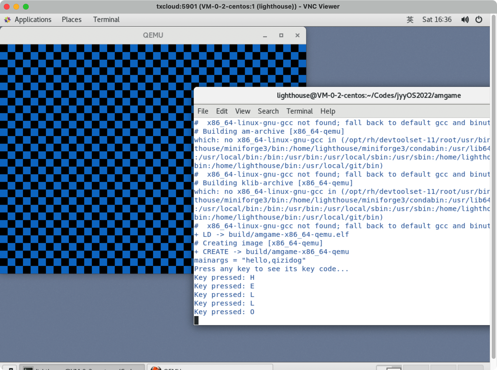

# jyyOS2022

2022南大jyy操作系统设计与实现课程相关代码

## amgame

[[L0]amgame实验要求](http://jyywiki.cn/OS/2022/labs/L0)

该试验需要借助桌面系统，因此推荐如下几种方式：

1. 安装linux-desktop虚拟机
2. [使用windows-wsl配合窗口工具](https://zhuanlan.zhihu.com/p/499141891)
3. 使用linux服务器+[远程桌面](https://www.jb51.net/article/172131.htm)

这里使用方式三。

整理一点拓展学习资料：

- [MakeFile Tutorial](https://makefiletutorial.com/)
- [跟我一起写Makefile](https://wiki.ubuntu.org.cn/跟我一起写Makefile)


### 实验环境搭建

1. 拉取远程框架

```bash
git clone https://github.com/NJU-ProjectN/os-workbench-2022  # 有就别拉了
cd os-workbench-2022
# git pull origin L0
git checkout L0
```

2. 先跑起来再说，进入目录，编译

```bash
cd amgame
make
# 成功之后获得build文件夹
# cd build
```

3. 从桌面环境（请各显神通）的terminal进入build目录

```bash
user@hostname:build$ qemu-system-x86_64 -drive format=raw,file=amgame-x86_64-qemu
```

获得如下结果（一个窗口的[黑白格](https://www.iqiyi.com/v_19rrmjkk40.html)🐶），说明环境配置成功。


amgame部分包含内容不多，主要就是 `game.c`, `video.c`, `keyboard.c` 三个部分，其中 `game.c` 是主程序分别调用另外两个程序的 `splash()` 和 `print_key()` 方法来绘制图形、监测键盘输入。

其实上面踩了个坑，启动之后应该会有命令行提示，并且能够监测键盘输入的，然而却什么输出都没有，也没有对键盘按键进行响应，解决方法是直接使用 `make run` 命令，在makefile文件里面藏的稍微深一点，没有找到，建议全局搜索 “run:” 你就能发现它，以及解锁 gdb 等更多功能。执行命令：

```bash
user@hostname:amgame$ make run mainargs=hello,qizidog
```

然后就发现终于能有提示语和键盘响应效果了（我在 `video.c` 中修改了一下白格的颜色～），可以看到键盘按键会在命令行终端输出。




### 一点小修改

其实就是抄了一下keyboard.c，在video.c中增加了一个move()方法，实现通过 `H`, `J`, `K`, `L` 控制画布内小方框的上下左右移动。此外，按ESC键退出程序。

```bash
#define KEYNAME(key) [AM_KEY_##key] = #key,

static const char *key_names[] = {
  AM_KEYS(KEYNAME)
};

static int last_x = 0, last_y = 0;
static int cur_x = 0, cur_y = 0;

void move() {
  /** 用 K J H L 四个键控制上下左右来移动小方块 */
  AM_INPUT_KEYBRD_T event = { .keycode = AM_KEY_NONE };
  ioe_read(AM_INPUT_KEYBRD, &event);
  if (event.keycode != AM_KEY_NONE && event.keydown) {
    puts("Key pressed: ");
    puts(key_names[event.keycode]);
    puts("\n");
  }
  last_x = cur_x;
  last_y = cur_y;
  if (event.keycode == AM_KEY_K && event.keydown) {
    cur_y = cur_y==0 ? 0 : cur_y-1;
  } else if (event.keycode == AM_KEY_J && event.keydown) {
    cur_y = cur_y*SIDE<h-SIDE ? cur_y+1 : cur_y;
  } else if (event.keycode == AM_KEY_H && event.keydown) {
    cur_x = cur_x==0 ? 0 : cur_x-1;
  } else if (event.keycode == AM_KEY_L && event.keydown) {
    cur_x = cur_x*SIDE<w-SIDE ? cur_x+1 : cur_x;
  } else if (event.keycode == AM_KEY_ESCAPE && event.keydown) {
    puts("Game Over!\n");
    halt(0);
  }
  if ((cur_x^last_x)||(cur_y^last_y)) {
    draw_tile(cur_x * SIDE, cur_y * SIDE, SIDE, SIDE, 0xdd4c35);
    draw_tile(last_x * SIDE, last_y * SIDE, SIDE, SIDE, ((last_x & 1)^(last_y & 1)) ? 0x007ACC : 0x0000);
  }
}
```


### 通过GDB连接QEMU进行调试

首先以调试模式启动qemu模拟器，程序在模拟器初始化完成后暂停（关于参数是怎么确定的，可以在项目中全局搜索 `QEMU_FLAGS`，答案自现）。

```bash
qemu-system-x86_64 -S -s \
              -serial mon:stdio \
              -machine accel=tcg \
              -drive format=raw,file=amgame-x86_64-qemu
```

- -S 在模拟器初始化完成 (CPU Reset) 后暂停
- -s 启动 gdb 调试服务器，可以使用 gdb 调试模拟器中的程序（shorthand for -gdb tcp::1234）
- -serial mon:stdio 监测标准输入输出
- -machine accel=tcg 设置加速器为tcg

然后另起一个终端，通过gdb远程连接启动后的模拟器。

```bash
$ gdb
(gdb) target remote localhost:1234
Remote debugging using localhost:1234
0x000000000000fff0 in ?? ()
(gdb) b *0x7c00
Breakpoint 1 at 0x7c00
(gdb) c
Continuing.

Breakpoint 1, 0x0000000000007c00 in ?? ()
(gdb) x/16i $pc
=> 0x7c00:  cli    
   0x7c01:  xor    %eax,%eax
   0x7c03:  mov    %eax,%ds
   0x7c05:  mov    %eax,%es
   0x7c07:  mov    %eax,%ss
   ...
```
